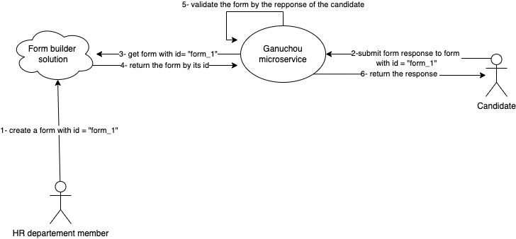

## Ganouchou microservice technical test


## Introduction 

<p>
Publicis sapient Human resources department wants to integrate a new contact form in the careers section for the company website that could be 
used by candidates to submit an application for a specific job inside PS. 
</p>

<p>
Since HR department members don't know how to code and they could not ping everytime a developer to make a change in the
form when they wants to, the company invests in a <b>form builder solution</b> where the HR members could create the form starting form 
a user interface and later we can get that specific form using its identifier from a provided REST endpoint. </p>

## The goal

<p> The goal is to create a REST endpoint in this project that we name  <b>Ganouchou microservice</b> that will be used to submit a response for a specific form definition 
and validate it by returning:
</p>
<ul>
<li>All the errors of the form response in case we have multiple errors</li>
<li>The response itself if no errors detected</li>
</ul>


## The architecture


## The project
This project could be updated in all its parts including the hierarchy, modules and naming **except the infra layer** `infra/**`
which is part of a contract with the **form builder solution provider**. 
<br>
On the other side it is possible to move the infra layer inside a module or rename it as you want.

## Example
Let's suppose, we have the current form definition in the `FormService.java` file: 
<br>
### Edge case
If we submit to the endpoint with the following request:
```JSON
{
  "fields": [
    { "name" : "candidate_surname", "value" : "Doe" },
    { "name" : "candidate_email", "value" : "peter.com" },
    { "name" : "candidate_phone_number", "value" : "0436543543" },
    { "name" : "candidate_skills", "value" : "Backend" }
  ]
}
```
Then, the endpoint should reject the request for the following reasons:
<ul>
<li><i>candidate_first_name</i> is a mandatory field</li>
<li><i>candidate_email</i> does not match the regex group which is in the form definition</li>
</ul>

### Happy path
If we submit to the endpoint with the following request:
```JSON
{
  "fields": [
    { "name" : "candidate_first_name", "value" : "Peter" },
    { "name" : "candidate_surname", "value" : "Doe" },
    { "name" : "candidate_email", "value" : "peter.doe@publicissapeint.com" },
    { "name" : "candidate_phone_number", "value" : "0436543543" },
    { "name" : "candidate_skills", "value" : "Backend" }
  ]
}
```
Then, the endpoint should accept the request because it follows all the declared constraints and even the missing fields in 
the request are not mandatory.
